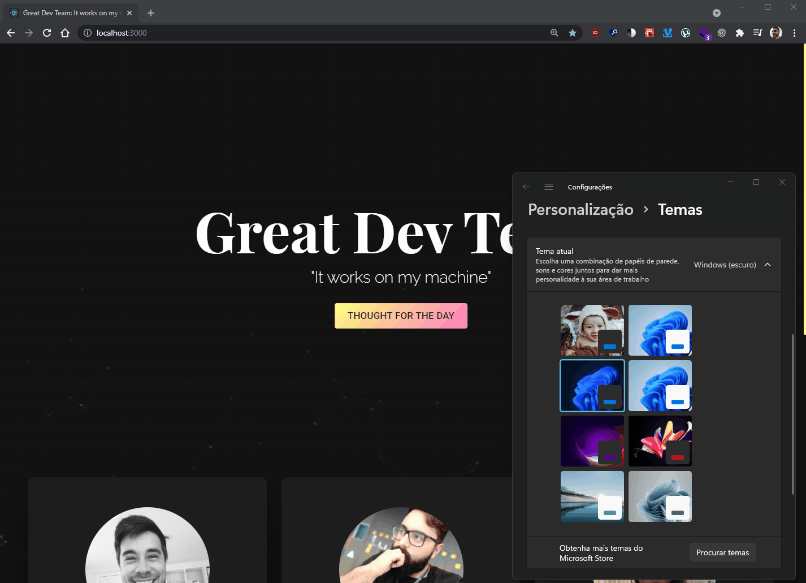

# Respeitando as configurações do usuários.

## Alterando tema e impactando na aplicação;

 
```SCSS
    :root{
        --background:white; 
    }
    @media (prefers-color-scheme: dark){
        :root{
            --background:black; 
        }
    }
```

## Reduzindo animações no dispositivo e impactando na aplicação;


```SCSS
    :root{
        --transitionTime: 0.2s;
    }
    @media (prefers-reduced-motion: reduce) {
        #tsparticles { display:none; }
        :root{
            --transitionTime: 0s;
        }
    }
``` 